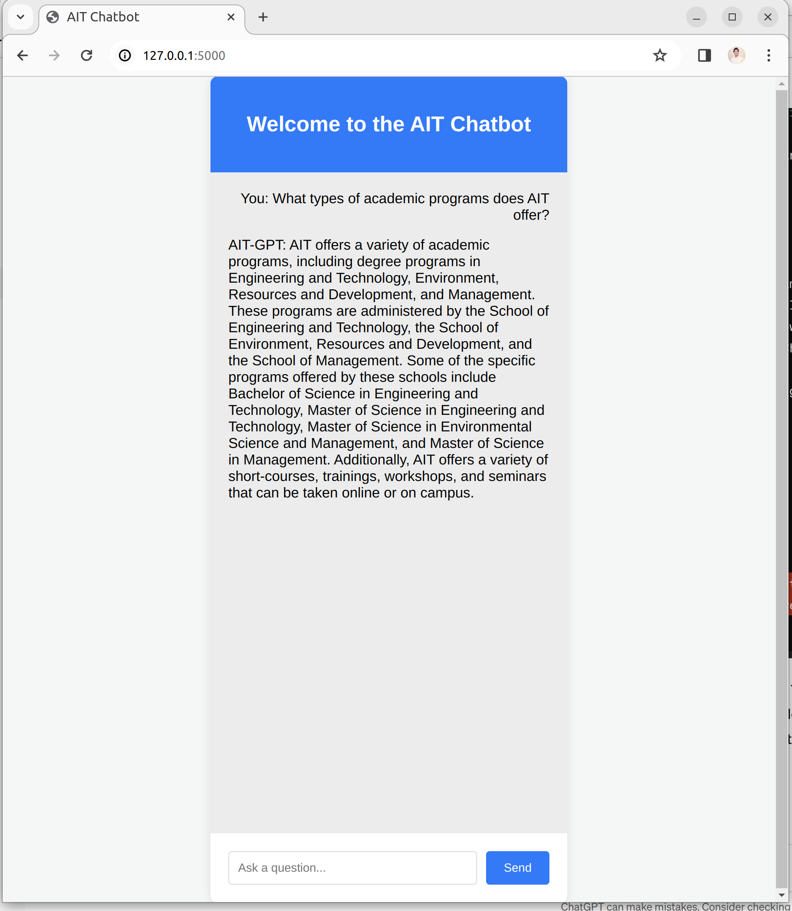

# AIT Chatbot

The AIT Chatbot is designed to assist students with questions related to the [Academic Institution/Topic]. Leveraging advanced NLP models, it provides real-time answers to a wide range of queries, from academic programs to campus life.

## Features

- **Real-time Interaction**: Engage with AIT-GPT in real-time to get answers to your questions.
- **Rich UI**: A user-friendly and attractive chat interface for easy interaction.
- **Powered by AI**: Utilizes cutting-edge NLP models for accurate and helpful responses.

## Technical Details

Retrieval-Augmented Generation (RAG) introduces an innovative approach to augment large language models (LLMs) with external, dynamically sourced data. This enables AI applications to reason about data beyond their original training sets, accommodating private data or newly available information post the model's training period.

`AIT Chatbot` is designed to enhance the learning experience in NLP courses, providing instant access to detailed explanations and information from course materials and relevant documents.


## Project Components

### 1. Prompt

The prompt system guides the model to generate responses that are relevant and coherent based on the user's query, incorporating context to improve accuracy.

### 2. Retrieval

The retrieval process is fundamental to sourcing relevant information from a diverse set of documents.

#### 2.1 Document Loaders

Document loaders extract text from various formats, enriching the bot's knowledge base.

#### 2.2 Document Transformers

Transformers segment large documents into digestible chunks, optimizing the retrieval process.

#### 2.3 Text Embedding Models

Embedding models convert text into vector representations, enabling semantic search functionalities.

#### 2.4 Vector Stores

Vector stores manage the storage and retrieval of text embeddings for efficient search capabilities.

#### 2.5 Retrievers

Retrievers use embeddings to identify and return documents relevant to user queries.

### 3. Memory

Memory components store interaction histories, providing context for response generation.

### 4. Chain

The RAG process chains together LLMs and other components, processing user queries to retrieve information and generate responses.


### AIT Data Scrapping
**Website Content Download and File Organization** automates the process of downloading specific file types from a given website and subsequently organizing them into a structured directory.

### Example Queries and Responses
`AIT Chatbot` leverages Python scripts to integrate these components, capable of answering a wide range of AIT-related questions by retrieving information from designated course materials and documents.


- **Query**: What types of academic programs does AIT offer?
- **Response**: AIT offers diverse academic programs in engineering, environmental sciences, and management.

- **Query**: How does AIT support its students' welfare?
- **Response**: AIT provides comprehensive support services including counseling, healthcare, and accommodation.

## Installation

This application is built with Flask and requires Python 3.7 or later. Follow these steps to set up the project locally:

1. **Clone the Repository**

    ```bash
    git clone https://github.com/shaficse/AIT-GPT.git
    cd AIT-GPT
    ```

2. **Set up a Virtual Environment** (Optional but recommended)

    ```bash
    python -m venv venv
    source venv/bin/activate  # On Windows use `venv\Scripts\activate`
    ```

3. **Install Dependencies**

    ```bash
    pip install -r requirements.txt
    ```

4. **Run the Application**

    ```bash
    flask run
    ```

    The application will be available at `http://127.0.0.1:5000`.

## Usage

After launching the app, navigate to `http://127.0.0.1:5000` in your web browser. Simply type your question into the input field and press "Send" or hit Enter. The AIT Chatbot will process your question and display the answer in the chat interface.



## Acknowledgments

- Thanks to the Hugging Face Transformers library for providing the NLP models.

